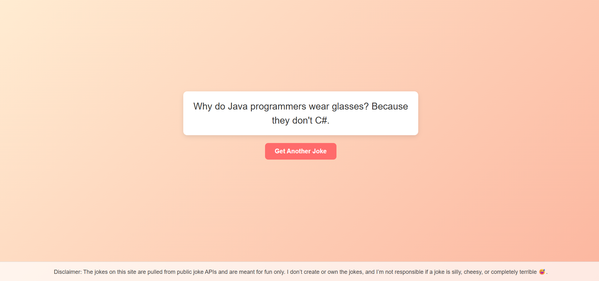

# Developer Jokes

A simple and fun web app that fetches **random jokes** using the [Official Joke API](https://github.com/15Dkatz/official_joke_api).  
Users can refresh for new jokes instantly and enjoy a lighthearted experience.

---

## 🚀 Features
- Fetches random jokes from an external API
- Easy "Get Another Joke" button
- Informative error message if the API is down
- API usage limit handling (100 jokes every 15 minutes)
- Responsive, clean UI design with CSS styling
- Disclaimer section for transparency

---
## 💻 Demo

🌐 **[Live Demo Here](https://developerjokes.netlify.app/)**  

## 📸 Preview
  

